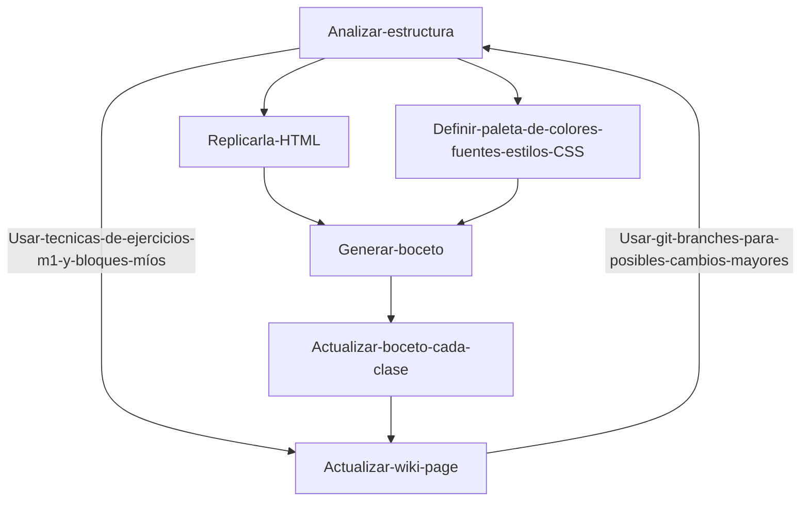

# 🌟 Proyect: Front-End Journey part two 🌟

<!--- Es una buena practica comentar, pero markdown es bastante "straight forward" no? -->

> _Este repositorio recopila mis avances en el curso de desarrollo front-end impartido por **Dev.F** 🚀, con la sensei **Dolores** ._

## ✅ Tabla de Contenidos

- [📖 Introducción](#-introducción)
- [🧰 Estructura del Proyecto](#-estructura-del-proyecto)
- [🖥️ Lista de clases](#-lista-de-clases)
- [🗺️ Roadmap tareas y pendientes](#-tarea-roadmap)
- [🚀 Workflow proyecto final](#-worflow-proyecto-final)
- [🔍 Retos y Soluciones](#-retos-y-soluciones)

## 📖 Introducción

> _Aquí encontrarás **ejercicios, experimentos, y ejemplos de código HTML y CSS** que documentan mi viaje en el mundo de la programación. **Mi meta** es aprender al máximo en cada paso y llegar a ser uno de los 150 seleccionados para la fase 2._ 🚀

## 🧰 Estructura del Proyecto

- `Clase xx-xx-xxxx` - Folders por clase cuando se requiera, contendrán los archivos creados.
- `px` - Proyectos y practicas recomendadas por el sensei (p de proyecto y el # de proyecto en clase).
- `README.md` - ¡Estás aquí! Una guía para navegar el repositorio y ver mis avances.
- `nombre y folder unico` - Cunando finalice un proyecto especifico lo renombrare con su titulo.
- `index.html` - Un index que redirige a todos las practicas que hemos estado llevando, para hostearlo en `pages`
- `assets` - Carpeta donde estarán la media usada en los proyectos.

## 🖥️ Lista de clases

| # de clase |                                Tema                                |
| ---------- | :----------------------------------------------------------------: |
| Clase #0   |   Introduccion a CSS:Historia, introducción, ejemplos de codigo    |
| Clase #1   |       Trabajando Box model, display, buenas practicas, etc.        |
| Clase #2   | Conceptos de herencia, especificidad y el efecto de cascada de CSS |

## 🗺️ Roadmap tareas y pendientes

> La misión final del módulo es entregar una page desplegada con estilo y una buena estructura en HTML, puede ser el proyecto final del módulo pasado (la verdad no voy a optar por esa opción, ya que estaba enfermo y no pude hacerlo como quería) O la Sensei nos proponía clonar una página y nos dio de opción de Starbucks.

| # de clase | Tarea                                                                                                                                      | Plan                                                                                                                                                                          | Status           |
| ---------- | ------------------------------------------------------------------------------------------------------------------------------------------ | ----------------------------------------------------------------------------------------------------------------------------------------------------------------------------- | ---------------- |
| Clase #0   | Crear repo y subirlo: empezar a trabajar el proyecto                                                                                       | -                                                                                                                                                                             | Entregada        |
| Clase #1   | Implementar el Box model, display y mantener las buenas pracicas al proyecto final, **entregar el ultimo commit**                          | Primero hacer el analisis de estructura de la pagina original y luego hacer el html, finalmente implementar el menu de navegacion y la paleta de colores, usando el box model | **SIN ENTREGAR** |
| Clase #2   | Implementar los conceptos de herencia y respetar el estilo del css para que sea limpio, puedo usar la clase `inherit` para heredar estilos | Integrar los elementos y limpiar el CSS                                                                                                                                       | **SIN ENTREGAR** |

## 🚀 Workflow proyecto final

## 🔍 Retos y soluciones

- **Reto 0:**  Definitivamente, se me dificulta un poco internalizar y entender de manera abstracta como interactúan los modos de `display`, no es complicado, pero si entendiera de una manera profunda y abstracta estoy seguro de que sería mucho más rápido el desarrollo para evitar errores inesperados en el diseño.
  **Solución:** Me voy a poner a estudiar padrino 🤠

  [¿Volver a inicio?](#-tabla-de-contenidos)