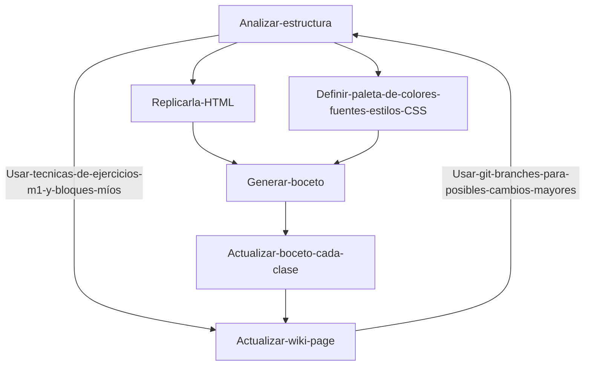

# 🌟 Project: Front-End Journey part two 🌟

<!--- Es una buena practica comentar, pero markdown es bastante "straight forward" no? -->

> _Este repositorio recopila mis avances en el curso de desarrollo front-end impartido por **Dev.F** 🚀, con la sensei **Dolores** ._

## ✅ Tabla de Contenidos

- [📖 Introducción](#-introducción)
- [🧰 Estructura del Proyecto](#-estructura-del-proyecto)
- [👩🏻‍🏫 Lista de clases](#-lista-de-clases)
- [🗺️ Roadmap tareas y pendientes](#%EF%B8%8F-roadmap-tareas-y-pendientes)
- [🚀 Workflow proyecto final](#-workflow-proyecto-final)
- [🔍 Retos y Soluciones](#-retos-y-soluciones)

<!-- Hey!!!!!! bingo! supongo que es el codigo hex o algo asi pero,%EF%B8%8F es el emoji del cohete  -->

## 📖 Introducción

> _Aquí encontrarás **ejercicios, experimentos, y ejemplos de código HTML y CSS** que documentan mi viaje en el mundo de la programación. **Mi meta** es aprender al máximo en cada paso y llegar a ser uno de los 150 seleccionados para la fase 2._ 🚀

## 🧰 Estructura del Proyecto

- `Clase xx-xx-xxxx` - Folders por clase cuando se requiera, contendrán los archivos creados.
- `px` - Proyectos y practicas recomendadas por el sensei (p de proyecto y el # de proyecto en clase).
- `README.md` - ¡Estás aquí! Una guía para navegar el repositorio y ver mis avances.
- `nombre y folder unico` - Cunando finalice un proyecto especifico lo renombrare con su titulo.
- `index.html` - Un index que redirige a todos las practicas que hemos estado llevando, para hostearlo en `pages`
- `assets` - Carpeta donde estarán la media usada en los proyectos.

## 👩🏻‍🏫 Lista de clases

| # de clase | Fecha      |                                        Tema                                        |
| ---------- | ---------- | :--------------------------------------------------------------------------------: |
| Clase #0   | 19-11-2024 |           Introduccion a CSS:Historia, introducción, ejemplos de codigo            |
| Clase #1   | 21-11-2024 |               Trabajando Box model, display, buenas practicas, etc.                |
| Clase #2   | 26-11-2024 |         Conceptos de herencia, especificidad y el efecto de cascada de CSS         |
| Clase #3   | 28-11-2024 |                                      FLEXBOX                                       |
| Clase #4   | 3-12-2024  |              Flexbox p2 (alineacion), práctica, nuevas etiquetas CSS               |
| Clase #5   | 5-12-2024  |                             Position, buenas practicas                             |
| Clase #6   | 10-12-2024 |      Paginas responsivas con el uso de mediaQueries & tips de nuestra Sensei       |
| Clase #7   | 12-12-2024 | Grid, repaso TOTAL, una mini implementacion de grid con un toque de JS, despedida. |

## 🗺️ Roadmap tareas y pendientes

> La misión final del módulo es entregar una page desplegada con estilo y una buena estructura en HTML, puede ser el proyecto final del módulo pasado (la verdad no voy a optar por esa opción, ya que estaba enfermo y no pude hacerlo como quería) O la Sensei nos proponía clonar una página y nos dio de opción de Starbucks.

| # de clase    | Tarea                                                                                                                                     | Plan                                                                                                                                                                          | Status       |
| ------------- | ----------------------------------------------------------------------------------------------------------------------------------------- | ----------------------------------------------------------------------------------------------------------------------------------------------------------------------------- | ------------ |
| Clase #0      | Crear repo y subirlo: empezar a trabajar el proyecto                                                                                      | -                                                                                                                                                                             | Entregada    |
| Clase #1      | Implementar el Box model, display y mantener las buenas pracicas al proyecto final, **entregar el ultimo commit**                         | Primero hacer el analisis de estructura de la pagina original y luego hacer el html, finalmente implementar el menu de navegacion y la paleta de colores, usando el box model | Entregada    |
| Clase #2      | Implementar los conceptos de herencia y respetar el estilo del css para que sea limpio                                                    | Integrar los elementos y limpiar el CSS, puedo usar la clase `inherit` para heredar estilos                                                                                   | Entregada    |
| Clase #3      | Implementar FLEXBOX (de manera simple)                                                                                                    | Implementarlo en la navbar                                                                                                                                                    | Entregada    |
| Clase #4      | Implementar flexbox para posicionar elementos                                                                                             | Posisionar las cards y sus elementos en la homepage                                                                                                                           | Entregada    |
| Clase #5      | Implementar position y z-index                                                                                                            | Integrar position y z-index va a venir excelente en las pages de rewards porque llevan un aside fixed                                                                         | Entregada    |
| Clase #6      | Iimplementar MediaQueries par hacer responsive la page                                                                                    | Integrar media queries en las paginas del proyecto starbonks tanto en project hub                                                                                             | Entregada    |
| Clase #7      | Implementar Grid y mantener un codigo limpio                                                                                              | Integrar Grid en la page del menu de opciones                                                                                                                                 | Entregada    |
| Entrega final | Entregar un proyecto desplegado en pages que contenga todos los elementos aprendidos en el curso implementados de la mejor manera posible | Entregar la page de starbucks y proyect hub II                                                                                                                                | SIN ENTREGAR |

## 🚀 Workflow proyecto final

## 🔍 Retos y soluciones

- **Reto 0:** Definitivamente, se me dificulta un poco internalizar y entender de manera abstracta como interactúan los modos de `display`, no es complicado, pero si entendiera de una manera profunda y abstracta estoy seguro de que sería mucho más rápido el desarrollo para evitar errores inesperados en el diseño.
- **Solución:** Me voy a poner a estudiar padrino 🤠
- **Reto 1:** El emoji "🖥️" bugea los links internos de markdown.
- **Solución:** Solamente escogí otro.
- **Reto 2** Me ha costado administrar los tiempos para documentar bien la wiki ni mi repo, pero estoy haciendo mi mejor esfuerzo.

## Dedicatoria

Gracias por ser parte inolvidable de mi camino de aprendizaje. Aprendí una incontable cantidad de cosas de cada uno de ustedes, son grandes personas y tienen mucho futuro. Yo ya gané con estos dos módulos, pero voy a quemarme las pestañas para poder ser escogido a la extensión de la beca. Amo esto, disfruto cada línea de código sin importar la hora o el lenguaje. Finalmente, la dedicatoria más importante es para Dios, sin él, nada sería posible. No estaba seguro de aplicar a la beca, pero Dios me guío a hacerlo, aun cuando no creía que fuera a quedar, así que, para Él, son todas mis líneas de código. `Hagan lo que hagan, trabajen de buena gana, como para el Señor y no como para nadie en este mundo. Colosenses 3:23`

<!-- Sigo teniendo ese deseo inherente de crear, tal vez así, te entienda más... -->

[¿Volver a inicio?](#-tabla-de-contenidos)
